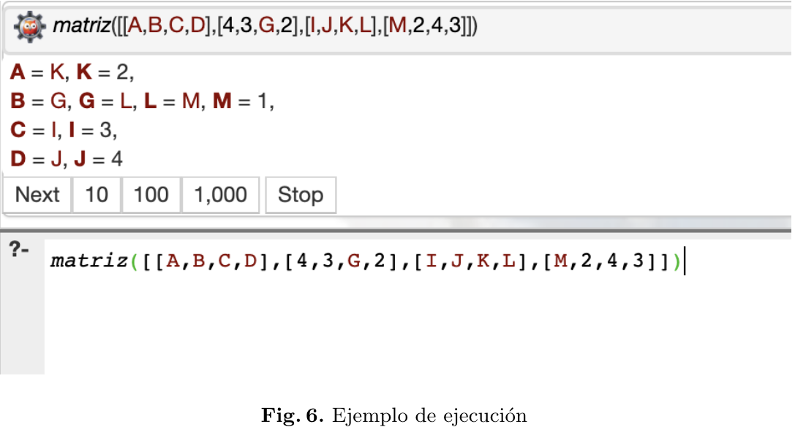

# Sudoku solver

This prolog program was developed for automated planning subject in Master of Artificial Intelligence (MUIA) - UPM in 2020

## How it works?:

I've defined the rules that must be satisfied to complete a sudoku.

Cannot be any number repeated in any:

1. Row
2. Column
3. Region

For example:

```
Start State:[[A,B,C,D],[E,F,G,H],[I,J,K,L],[M,N,O,P]
Goal State:[[2,1,3,4],[4,3,1,2],[3,4,2,1],[1,2,4,3]]
```

## Execution

```
?- matriz([[A,B,C,D],[4,3,G,2],[I,J,K,L],[M,2,4,3]]).
```

You can try using prolog in your system or using a web compiler: [https://swish.swi-prolog.org/p/sudoku-automated-planning-muia.pl](https://swish.swi-prolog.org/p/sudoku-automated-planning-muia.pl)



## Author

Antonio Sejas - 2020
MIT License
